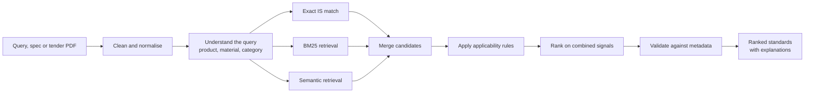

<div align="left">

# Manakya

**Describe what you're buying. Get the Indian Standards that apply, and the reason why.**

Smart India Hackathon 2026 &nbsp;·&nbsp; 

[The problem](#the-problem) ·
[What it does](#what-it-does) ·
[How it works](#how-it-works) ·
[Run it locally](#run-it-locally) ·
[What's next](#whats-next)

</div>

<br>

<!-- Add a demo GIF or a hero screenshot here. It's the first thing people look at. -->


<!--  -->

## The problem

Every product bought through public procurement has to meet an Indian Standard. Finding the right one is harder than it sounds.

There are thousands of IS codes. A tender says "ordinary portland cement, 43 grade" while the standard is titled something slightly different. Someone types "sttel" instead of "steel". Two standards share half their vocabulary but cover different products. A code that looked right turns out to have been withdrawn and replaced years ago.

Today this is solved by experience and a lot of manual searching. Velocia is our attempt to make it fast, and to make the answer explain itself.

## What it does

You give Velocia a product description, a technical specification, or a tender document. It returns a ranked list of Indian Standards that are likely to apply, and for each one it shows which signals put it there.

- **Understands meaning, not just keywords.** "Cement for foundation work" can find a standard that never uses the word "foundation".
- **Still respects exact terms.** IS numbers, titles and technical vocabulary are matched with BM25, because embeddings alone are bad at precise identifiers.
- **Copes with messy input.** Typos and spelling variations don't send the search off course.
- **Knows what the product is.** Product, material, category and application are extracted from the query and checked against each candidate.
- **Filters out near-misses.** Applicability rules remove standards that look similar but clearly don't fit.
- **Reads tender documents.** Requirements are pulled out of procurement PDFs so nobody has to read forty pages to find three lines.
- **Checks the record.** Withdrawn, superseded, duplicate and under-review standards are flagged using the standard's metadata.
- **Shows its work.** Every recommendation comes with the reasons behind it.

## Why it explains itself

A list of IS codes with no reasoning is hard to trust, especially in procurement where someone has to sign off on the choice. So each result carries the evidence for it:

| Signal | What it tells you |
| --- | --- |
| Exact IS match | The input already named this standard |
| Keyword relevance and BM25 | How closely the wording lines up |
| Semantic similarity | How close the meaning is |
| Product, material, category, application | Whether the standard is actually about this thing |
| Rule validation | Whether domain applicability conditions hold |
| Metadata validation | Whether the standard is still in force |

No single score decides. A standard that scores well on wording but fails the product check gets pushed down, and you can see why.

<!-- Replace with a real screenshot of a result card. -->
<!--  -->

## How it works

Velocia is a multi-stage pipeline. Each stage removes noise so the next one has less to get wrong.



1. **Input.** A plain-language query, a specification, or an uploaded tender.
2. **Preprocessing.** Text is cleaned and normalised, and common typos are handled.
3. **Query understanding.** Products, materials, categories and technical terms are identified.
4. **Exact matching.** If the user already typed an IS number, we catch it first.
5. **BM25 retrieval.** Strong on titles, codes and specific terminology.
6. **Semantic retrieval.** Embedding similarity, strong on paraphrase and intent.
7. **Candidate filtering.** Product, category and applicability rules cut the list down.
8. **Ranking.** The signals above are combined into one ordering.
9. **Validation.** Obvious mismatches and problem records are removed or flagged.
10. **Explanation.** Each result is returned with the reasons behind it.

### Why two retrievers

Keyword search and semantic search fail in opposite ways. BM25 is precise about "IS 269" but blind to synonyms. Embeddings understand "cement for a foundation" but can blur one standard into its neighbour. Running both and merging the results gave us better coverage than either alone.

## Project structure

```
Manakya/
├── backend/     # retrieval, ranking and rules
├── frontend/    # the interface
└── README.md
```

## Run it locally

<!-- Fill in the exact commands below from your own setup, then delete this comment. -->

You'll need the tools for both halves of the project. Fill in versions here once they're pinned.

```bash
git clone https://github.com/rohitkumawat-dev/Manakya.git
cd Manakya
```

**Backend**

```bash
cd backend
# install dependencies
# build the search index (one-time)
# start the server
```

**Frontend**

```bash
cd frontend
# install dependencies
# start the dev server
```

Then open the local address the frontend prints and try a query such as:

> ordinary portland cement, 43 grade, for general construction

## Where the data comes from

The standards data is built from publicly available information about Indian Standards: IS number, title, scope, status and amendment details. The quality of a recommendation depends directly on how complete this data is, so coverage grows as we add more standards.

## Honest limits

- Velocia is decision support. It narrows a large search space and shows its reasoning, but a person should confirm the final choice, especially where certification or compliance is involved.
- Results are only as good as the standards data loaded behind them.
- Applicability rules are written per domain, so a newly added domain starts with weaker rules until they're written.

## What's next

- Multilingual queries, so a procurement officer can search in the language they actually use
- Allied standards alongside each result: test methods, terminology, safety and related product standards
- Pointers to mandatory certification requirements where they apply
- Automated refresh of the standards data, with a visible "last updated" date

## Built by

Made for Smart India Hackathon 2026 by [@rohitkumawat-dev](https://github.com/rohitkumawat-dev) 

<!-- Add teammates' names and GitHub links here. -->

<br>

<div align="center">

Author: Rohit Kumawat

</div>
